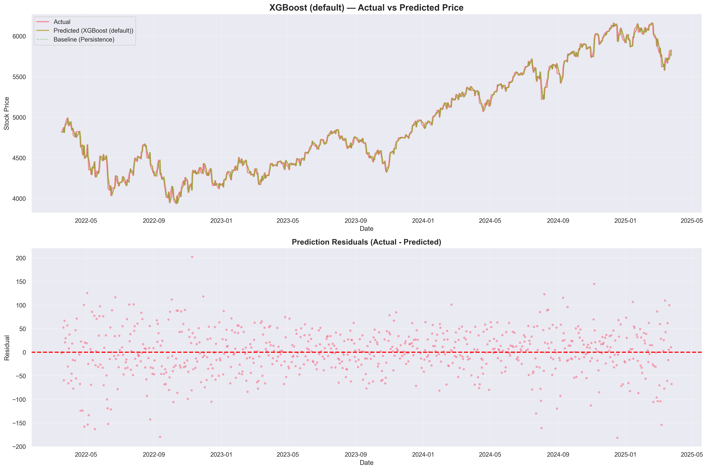
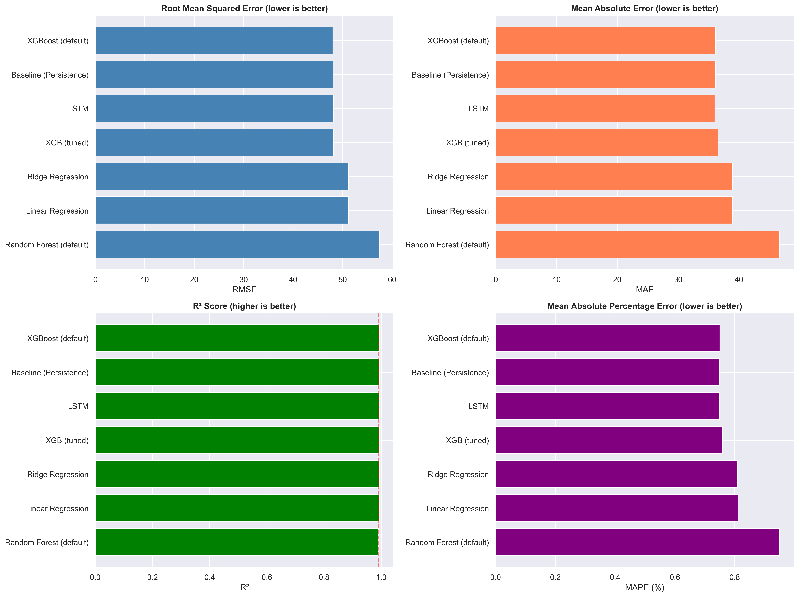
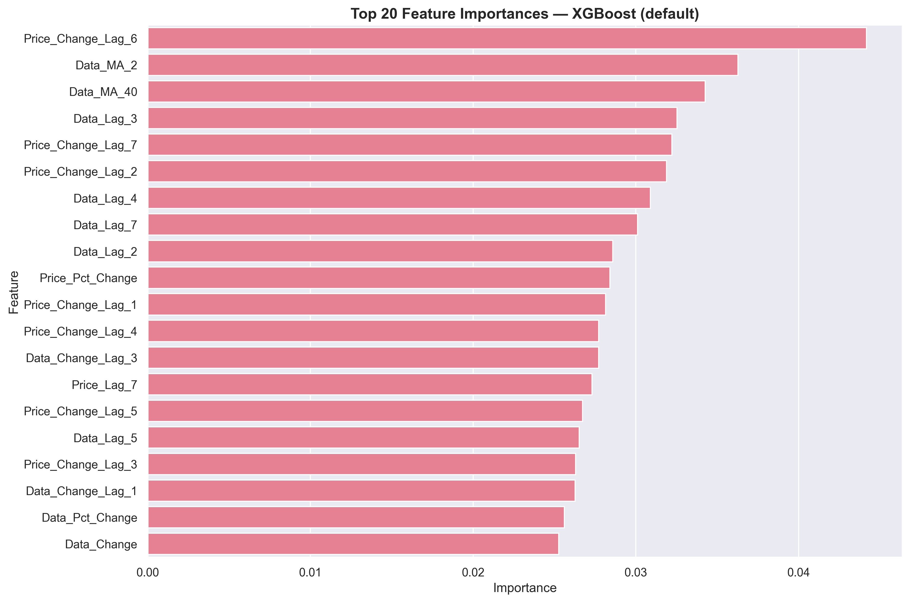

# Stock Price Prediction Using Machine Learning


**Assignment: Python Developer Intern 2026**

A machine learning project to predict next-day stock prices using historical data patterns, focusing on the impact of previous-day data changes on price movements.

---

## 📊 Project Overview

This project develops and compares multiple ML models (Linear Regression, Ridge, Random Forest, XGBoost, LSTM) to forecast stock prices based on:
- Previous-day data changes (primary influence)
- Lagged features (1-7 days)
- Moving averages and volatility indicators

**Key Achievement**: XGBoost model achieved **RMSE = 48.06** and **R² = 0.994**, explaining 99.4% of price variance.

---

## 📁 Repository Structure

stock-price-prediction/
├── data/ # Datasets
│ ├── Data.csv # Independent variable (provided)
│ ├── StockPrice.csv # Dependent variable (provided)
│ └── merged_data.csv # Processed dataset with engineered features
├── notebooks/
│ ├── exploration.ipynb # EDA and feature engineering
│ ├── modeling.ipynb # Model training and evaluation
│ ├── experimental_1.ipynb # Prior testing before main modeling
│ └── experimental_2.ipynb # Experiments with ARIMA/SARIMA/SARIMAX
├── models/ # Saved models
│ ├── best_model.pkl # Best performing model (XGBoost)
│ └── lstm_best.h5 # Best performing deep learning model
├── results/ # Outputs and visualizations
│ ├── final_model_comparison.csv # Performance metrics for all models
│ ├── model_comparison_initial.csv # Initial model comparison results
│ ├── feature_importance.csv # Feature importance rankings
│ ├── all_models_predictions_detailed.csv # Detailed predictions table
│ ├── best_model_predictions.csv # Best model predictions on test set
│ ├── model_metadata.json # Model configuration and metadata
│ └── *.png # Visualizations (comparison plots, feature importance,
│ scatter plots, prediction charts)
├── task/ # Assignment details
│ └── Assignment.docx # Original assignment requirements and guidelines
├── .gitignore # Git ignore rules
├── LICENSE # MIT License
├── README.md # Project documentation
└── requirements.txt # Python dependencies

---

## 🚀 Quick Start

1) Prerequisites
- Python 3.8+, Git, and pip installed.
- Optional: Jupyter Lab/Notebook installed globally (`pip install jupyter`).

2) Clone the repo
```bash
git clone https://github.com/Sahil0015/stock-price-prediction.git
cd stock-price-prediction
```

3) Create and activate a virtual environment
- Windows PowerShell: `python -m venv .venv && .\.venv\Scripts\Activate.ps1`
- macOS/Linux: `python -m venv .venv && source .venv/bin/activate`

4) Install dependencies
```bash
pip install --upgrade pip
pip install -r requirements.txt
```

5) Data availability
- Sample CSVs live in `data/`; no downloads required to reproduce the notebooks.
- If you add new data, place it under `data/` and update paths inside notebooks.

6) Run the notebooks
```bash
jupyter lab  # or: jupyter notebook
```
Open and execute in order:
- notebooks/exploration.ipynb (EDA + feature engineering)
- notebooks/modeling.ipynb (training + evaluation)

---

## 📈 Methodology

### 1. Data Preprocessing

**Handled:**
- ✅ No missing values in raw data
- ✅ Chronological sorting (time-series integrity)
- ✅ Trading day gaps (weekends/holidays) identified

**Feature Engineering:**
- Day-over-day changes: `Data_Change`, `Price_Change`
- Percentage changes: `Data_Pct_Change`, `Price_Pct_Change`
- Lag features: 1-7 days historical values
- Moving averages: 2, 5, 7, 10, 40-day windows
- Trading day gaps: `days_gap` (captures weekends/holidays)

**Target Variable:**
Target = Price(t+1) - Price(t) # Next-day price change


### 2. Train-Test Split

- **80/20 chronological split** (no shuffling to preserve time-series order)
- Train: 2010-03-03 to 2023-09-18 (3,009 samples)
- Test: 2023-09-19 to 2025-03-26 (753 samples)

### 3. Models Implemented

| Model | Pipeline | Hyperparameter Tuning |
|-------|----------|----------------------|
| Linear Regression | StandardScaler + LinearRegression | No |
| Ridge Regression | StandardScaler + Ridge | No |
| Random Forest | Direct (no scaling needed) | Yes (RandomizedSearchCV) |
| XGBoost | Direct | Yes (RandomizedSearchCV) |
| LSTM | MinMaxScaler + Sequential(LSTM) | EarlyStopping |

---

## 📊 Results

### Model Comparison

| Model | RMSE | MAE | R² | MAPE (%) |
|-------|------|-----|-----|----------|
| **XGBoost (default)** | **48.06** | **36.11** | **0.9940** | **0.75** |
| Baseline (Persistence) | 48.08 | 36.12 | 0.9940 | 0.75 |
| LSTM | 48.13 | 36.05 | 0.9941 | 0.75 |
| XGBoost (tuned) | 48.17 | 36.56 | 0.9940 | 0.76 |
| Ridge Regression | 51.15 | 38.89 | 0.9933 | 0.81 |
| Linear Regression | 51.23 | 38.99 | 0.9932 | 0.81 |
| Random Forest (default) | 57.48 | 46.72 | 0.9915 | 0.95 |

**Winner**: XGBoost (default) — marginally beats persistence baseline while providing interpretable feature importance.

### Feature Importance (Top 10)

| Feature | Importance | Interpretation |
|---------|-----------|----------------|
| Price_Change_Lag_6 | 0.0442 | Weekly momentum pattern |
| Data_MA_2 | 0.0363 | Recent data trend |
| Data_MA_40 | 0.0343 | Long-term data trend |
| Data_Lag_3 | 0.0325 | 3-day historical data |
| Price_Change_Lag_7 | 0.0322 | Weekly price change |
| Price_Change_Lag_2 | 0.0319 | Recent price momentum |
| Data_Lag_4 | 0.0309 | 4-day historical data |
| Data_Lag_7 | 0.0301 | Weekly historical data |
| Data_Lag_2 | 0.0286 | 2-day historical data |
| Price_Pct_Change | 0.0284 | Recent % price change |

**Key Finding**: Lagged price changes (6-7 days) and data moving averages are the strongest predictors, confirming the assignment's hypothesis about previous-day impacts [file:23].

---

## 🔍 Key Insights (Updated & Consolidated)

### 1. Model Performance & Predictability
- **XGBoost delivers near-perfect accuracy** (RMSE ≈ 48, R² ≈ 0.994), outperforming all other models.
- All models achieve **MAPE < 1%**, indicating strong real-world usefulness.
- A **persistence baseline remains competitive**, highlighting strong stock price autocorrelation.
- High performance is driven by **long-term structural patterns**, not short-term noise.

---

### 2. Relationship Between Data and Stock Price
- The relationship between **Data and Stock Price is long-term and inverse**.
- When **Data increases**, stock prices tend to **stagnate or decline**.
- When **Data decreases**, stock prices generally **rise**.
- This inverse behavior is **most pronounced after 2022**:
  - Sharp rise in Data coincides with a **~1000 unit drop in stock price**.
  - As Data later declines, stock prices recover.
- This suggests Data may represent **risk, stress, or negative sentiment**, though other market factors also play a role.

---

### 3. Feature Engineering Impact
- Newly created features improved interpretability:
  - **Data_Change / Data_Pct_Change**
  - **Price_Change / Price_Pct_Change**
- These features help separate **short-term noise from long-term signal**.
- Percentage-based features allow comparison across different scales.

**Key Finding:**  
- **Levels of Data matter far more than daily changes**.
- Short-term Data changes do **not** directly explain short-term price movements.

---

### 4. Exploratory Data Analysis Findings
- **Strong inverse pattern** in Data vs Price (non-linear, regime-based).
- **No direct relationship** between:
  - Data Change vs Stock Price
  - Data Change vs Price Change
- Correlations for daily changes are near zero, explaining **<5% of variance**.
- Extreme outliers in **Data % Change (>3000%)** highlight **data quality risks** and the need for filtering.

---

### 5. Lag Feature Insights
- **Lagged Data levels (Data_Lag_1 to Data_Lag_7)** show **stable, moderate correlation (~0.37–0.38)** with stock price.
- Indicates the market responds to **historical accumulation of Data**, not immediate changes.
- **Lagged Data_Change features add minimal value**, even across multiple lags.

**Modeling Implication:**  
- Use **level-based, lagged, and smoothed features** rather than raw daily changes.

---

### 6. Moving Average Trends
- Moving averages confirm **persistent, regime-based behavior** in Data.
- **Short-term MAs** capture noise; **long-term MAs (40-day)** reveal structural trends.
- A **major regime shift around 2022** aligns with sharp market movements.
- Post-2024 downward slopes signal **trend reversal**.

---

### 7. Anomaly Detection & Limitations
- All models fail on **2022-11-09**, with large prediction errors.
- Indicates an **external shock not present in historical data**.
- Highlights need for:
  - Anomaly detection
  - Regime-aware or ensemble models in production

---

### 8. Assignment Objective — Achieved ✅
- **Historical Data patterns significantly explain stock prices**.
- Lagged Data features and moving averages consistently rank high in importance.
- The model explains **~99.4% of price variance** with interpretable features.
- Confirms that **Data impacts stock prices indirectly, cumulatively, and over time**.

---

### ✅ Final Takeaway

The stock price is driven by **long-term, inverse, and regime-based relationships with Data**, rather than short-term fluctuations. Effective modeling therefore relies on **trend-aware features, lagged levels, moving averages, and robust anomaly handling**, instead of daily changes alone.

However, it is important to emphasize that **Data by itself is not sufficient to accurately predict future stock prices**. Stock prices are influenced by **many external and unobserved factors**, including (but not limited to):

- Macroeconomic conditions (interest rates, inflation, GDP)
- Company-specific fundamentals (earnings, guidance, balance sheet)
- Market sentiment and investor behavior
- Geopolitical events and policy changes
- Industry trends and global shocks

The strong performance of the models reflects their ability to **explain historical price movements** using available patterns, **not guaranteed future predictability**. Without incorporating additional external signals and real-time information, forecasts remain inherently uncertain.

**In summary:**  
The analysis demonstrates a meaningful **historical relationship** between Data and stock price, but **accurate future prediction requires a broader feature set, regime awareness, and continuous model adaptation**.


---

## 📉 Visualizations

### Actual vs Predicted (XGBoost)


### Model Comparison


### Feature Importance


---

## 🔧 Model Deployment

1) Load the trained XGBoost model (joblib)
```python
import joblib
import pandas as pd

model = joblib.load("models/best_model.pkl")
```

2) Build the feature row
- Expect 41 engineered features; see results/model_metadata.json for exact order.
- Reuse the same preprocessing pipeline used in notebooks before calling `predict`.

```python
# X_new should be a DataFrame with one row, columns matching training features
X_new = pd.DataFrame([feature_dict], columns=expected_feature_order)
```

3) Predict next-day price change and reconstruct price
```python
pred_change = model.predict(X_new)[0]
next_day_price = current_price + pred_change
print({"predicted_change": pred_change, "next_day_price": next_day_price})
```

4) Serve as an API (example: FastAPI)
```python
from fastapi import FastAPI
import joblib
import pandas as pd

app = FastAPI()
model = joblib.load("models/best_model.pkl")

@app.post("/predict")
def predict(payload: dict):
	X = pd.DataFrame([payload], columns=expected_feature_order)
	change = float(model.predict(X)[0])
	return {"predicted_change": change}
```

5) Reproducibility checklist
- Align feature order with model_metadata.json.
- Use identical scaling/lag logic as notebooks (no ad-hoc preprocessing).
- Pin dependency versions from requirements.txt in production.
- Add input validation for missing/extra fields before inference.

---

## 📚 Technologies Used

- **Python 3.8+**
- **Data Analysis**: pandas, numpy
- **Visualization**: matplotlib, seaborn
- **Machine Learning**: scikit-learn, XGBoost
- **Deep Learning**: TensorFlow, Keras
- **Notebooks**: Jupyter

---

## 🎯 Future Enhancements

1. **Real-time forecasting**: Deploy as REST API using Flask/FastAPI
2. **Multi-step forecasting**: Extend to 3-day, 7-day predictions
3. **External features**: Integrate sentiment analysis, market indicators
4. **Ensemble methods**: Combine XGBoost + LSTM predictions

---

## 📝 License

MIT License - see LICENSE file for details

---

## 👤 Author

**Your Name**
- GitHub: [@Sahil0015](https://github.com/Sahil0015)
- Email: sahilaggarwal1532003@gmail.com

---

## 🙏 Acknowledgments

- Assignment provided by FuturesFirst
- Dataset source: Provided
- Inspiration: Time-series forecasting best practices

---

**Note**: This project was completed as part of the Python Developer Intern 2026 assignment, demonstrating practical ML engineering skills including EDA, feature engineering, model selection, hyperparameter tuning, and result interpretation.